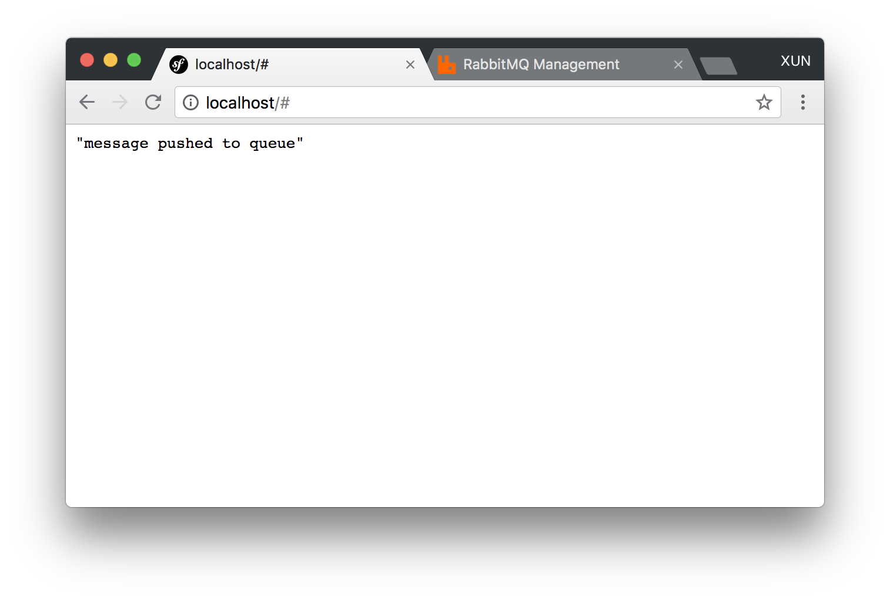
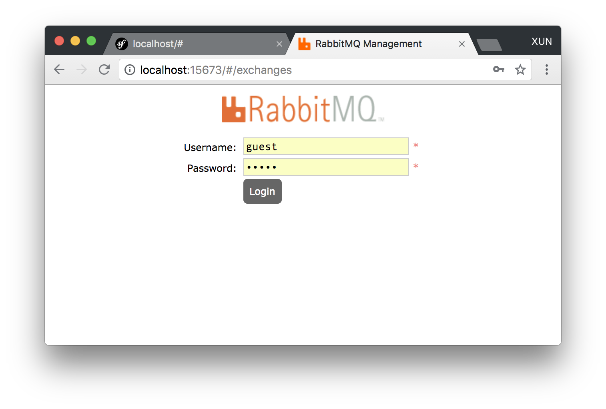

# Symfony Examples for Enqueue Bundle 

The project is used to play with symfony enqueue bundle in docker environments. It contains rabbitmq and symfony app as service
containers.
  
## Setup

```
git clone https://github.com/vikbert/symfony-enqueue-examples.git
cd symfony-enqueue-examples
git clone git@github.com:php-enqueue/enqueue-dev.git dev
./bin/sandbox -b
./bin/sandbox -u
```

## Usage

Run docker containers

```
./bin/sandbox -u
```

Enter to sandbox container

```
./bin/sandbox -e
```

## Websites
access the page to send the messages to `RabbitMQ`

```
http://localhost
```



access the admin UI of `RabbitMQ`

```
http://localhost:15673/#/queues
```


## Play with examples

Step 01: `./bin/sandbox -u`
Step 02: go to `http://localhost` to push the message to queue
Step 03: go to `http://localhost:15673/#/queues` to check the message queues.
Step 04: if no queues found on rabbitMQ, then `./bin/sandbox -e` to enter the container
Step 05: start the consumer bin/console enqueue:consume --setup-broker -vvv`


